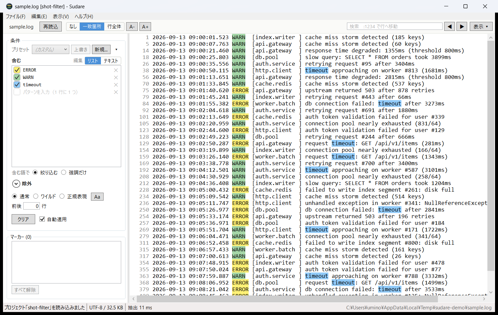
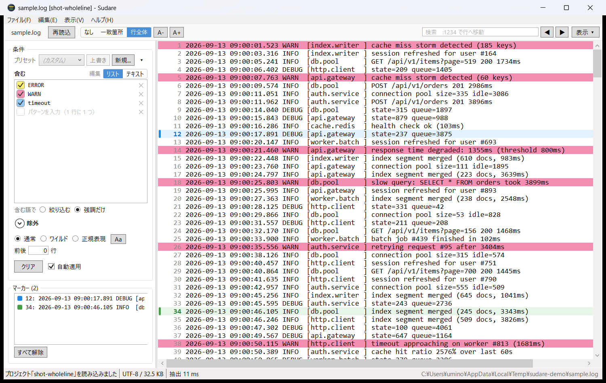
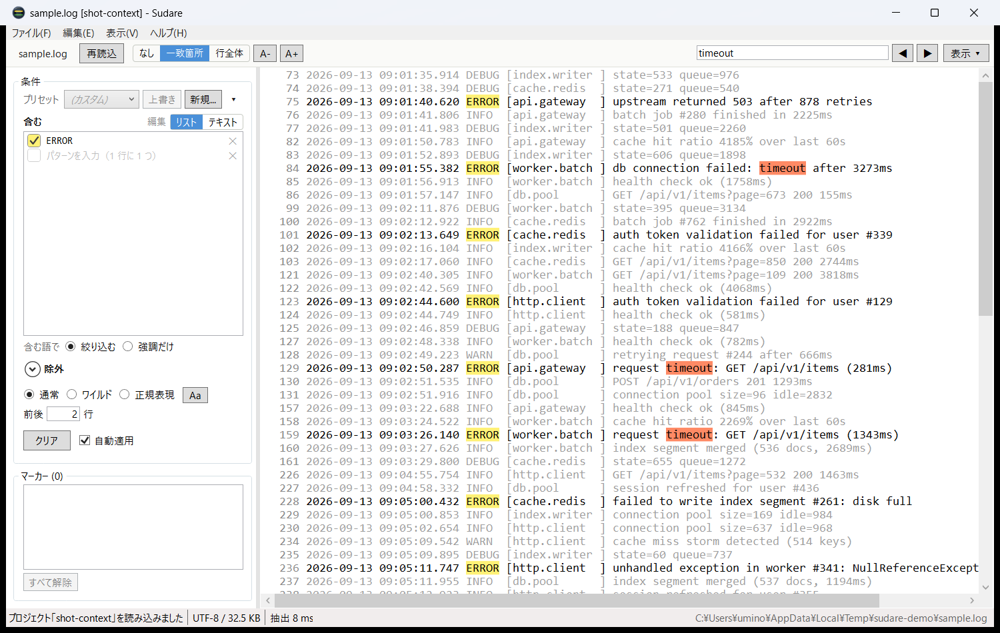

# Sudare（簾）

見たい行だけを残して読む、ログ閲覧に特化した Windows 向けテキストビューア（C# / WPF / .NET 8）。

<br clear="left">


**positive words（含む語）** と **negative words（除外語）** のリストを入力すると、
条件に一致した行だけを抜き出して表示します。100MB 級のログでも操作感が落ちないことを目標に作っています。

## 画面



`ERROR` `WARN` `timeout` の 3 語で絞り込んだところ。行番号が飛んでいるのが抜き出された印で、
語ごとに違う色が付きます。左の一覧はチェックで 1 行ずつ条件から外せ、
色見本を右クリックすると色を選び直せます。



「絞り込まず強調だけ」と「行全体に色を付ける」を組み合わせたところ。
全行を表示したまま、当たった行が色の帯として浮かびます。
左端の青と緑の帯はマーカーで、下の一覧からその行へ飛べます。



`ERROR` の前後 2 行を文脈として一緒に表示したところ。文脈行はグレーで一致行と見分けられます。
検索語（`timeout`）は行の色の上に橙色で重ねて示されます。

---

## 主な機能

### 読み込み元
- **ファイル** — メニュー、ツールバー、ドラッグ＆ドロップ、コマンドライン引数
- **クリップボード**（`Ctrl+Shift+V`） — コピーしたテキストをそのままログとして読み込む。
  ターミナルの出力やチャットに貼られたログ断片を、ファイルに保存せずそのまま絞り込める。
  読み込み後はファイルと全く同じフィルタ・検索・保存機能が使える
- どちらも `F5` で再読み込み（クリップボードの場合はもう一度クリップボードを読み直す）

### 画面構成

上部は **メニュー**（すべてのコマンドがある場所）と **操作バー**（読みながら手が伸びるものだけ）の 2 段です。
左ペインは **条件** と **マーカー** の 2 つで、スプリッタで縦を分け合います。

| 場所 | 内容 |
|---|---|
| **操作バー** | 開いているログ（`▾` に開く・クリップボード・最近使ったファイル・プロジェクト・抽出結果の保存）/ 再読込 / 自分で選んだ項目 / 検索 / `表示 ▾` |
| **条件** | プリセット / 含む / 絞り込む・強調だけ / 除外（折りたたみ）/ 解釈・大文字小文字・前後 n 行 / 適用・クリア |
| **マーカー** | マーカーの一覧とジャンプ（常設） |
| **`表示 ▾`** | 折り返し / 行番号 / 条件ペイン / 強調（なし・一致箇所・行全体）/ 文字サイズ・フォント / 文字コード |

条件は `適用`（または「自動適用」）で反映され、それ以外は変更した瞬間に反映されます。
「自動適用」が ON のあいだは、押す必要のない `適用` ボタンを出しません。

#### ツールバーは自分で決める
- 操作バーの帯を**右クリック**すると、`表示 ▾` の項目（折り返し / 行番号 / 強調 / 文字サイズ /
  フォント / 文字コード / 条件ペイン）をバーに出し入れできます
- 既定は **強調** と **文字サイズ** の 2 つだけ。並び順は固定で、選ぶのは「出すかどうか」です
- 選んだ内容は設定に保存されます

### 行フィルタ
- 「含む」「除外」の 2 つのリストに、**1 行 1 パターン**で入力する
- 「含む」「除外」とも **OR（いずれかに一致）** で判定する（AND は使わないので持たない）
- 「含む」が空なら全行が対象。「除外」に一致した行は、含む条件を満たしていても表示しない
- `#` で始まる行はコメントとして無視される
- 大文字小文字の区別を切り替え可能

#### 「含む」の行ごと ON/OFF
- 「含む」は 1 行ずつチェックボックス付きで並び、**行単位で条件から外せる**。
  外しても文言は残るので、書き直さずに試行錯誤できる
- チェック欄は**その行がログ本文で使う強調色そのもの**で塗られる。
  どのパターンがどの色に対応しているかが一目で分かる
- 色は「空でない行の並び順」で決まる。OFF の行も順番だけは数に入れるので、
  チェックを外しても他の行の色はずれない
- OFF の行は内部的には `#` 始まりのコメント行として保持される。
  ヘッダの `編集: リスト / テキスト` で素のテキスト編集に切り替えられ、
  そこで書いた `#` 行はそのまま OFF として読み込まれる
  （まとめて貼り付けたいときはこちらが早い）

#### 「含む」の色を行ごとに変える
- 行の左の**色見本（チェック欄）を右クリック**すると、その行の強調色を
  **黄 / 緑 / 青 / 橙 / 紫 / 水色 / 桃 / 黄緑** の 8 色から選び直せる
- 本文の強調はその場で塗り直される。色は抽出結果に影響しないので、照合はやり直さない
- メニューの「自動（並び順）」で選んだ色を解除し、並び順で決まる色に戻せる。
  チェックが付くのは自分で選んだ色（何も選んでいなければ「自動」）
- 選んだ色はパターンに付いて回る。行を削除・追加しても、残った行の色は変わらない
  （自動のままの行は、これまでどおり並び順で色が決まる）
- `テキスト` での編集中も色は引き継がれる。同じ文言の行を探して渡し、
  見つからない場合は行数が変わっていなければ同じ位置の行から受け取る（1 行を書き換えている途中とみなす）
- 自動の行と同じ色を選ぶこともできる。見分けたいときは、どちらかの色を選び直す
- 空の入力行では色のメニューは出ない
- 設定・プロジェクト・プリセットのいずれにも保存される。色を持たない古いファイルは、すべて自動として読み込む
- 色だけを変えた場合も、プリセットとは別の条件として `(カスタム)` 表示になる
  （プリセットを選び直せば、そのプリセットの色に戻る）

#### 行全体に色を付ける
- 操作バーの `表示 ▾`（またはメニューの `表示`）で強調を **行全体** にすると、
  一致した箇所ではなく**行全体の背景**を「含む」の色で塗る。どの行がどのパターンに当たったかを帯として追える
- 強調は **なし / 一致箇所 / 行全体** の 3 段階から選ぶ（以前の 2 つのチェックボックスを 1 つにまとめたもの）
- 「強調のみ」と組み合わせると、全行を表示したまま注目したい行だけが色の帯で浮かぶ
- 1 行が複数のパターンに一致した場合は、**リストで上にあるパターンの色**になる
- 検索語は従来どおり一致箇所だけを強調する（行の色の上に重なって見える）
- マーカーの付いた行でも、**行の背景はこちらの色が優先**。マーカーは左端の帯と太字の行番号で分かる
- 一致の判定は抽出と同じく行全体で行う。一致箇所の強調（先頭 4,000 文字まで）と違い、
  長い行の後半で一致しても色が付く
- 選択中の行・マウスを乗せた行は、従来どおり選択色が優先される
- 強調が「なし」のときは色が付かない
- 表示の設定なので、設定とプロジェクトに保存される（プリセットには含めない）
- `Ctrl+Enter` を押さなくても、切り替えた瞬間に反映される（照合はやり直さない）

#### 行は絞り込まず、強調だけする
- 「含む」の下のチェックを ON にすると、**全行を表示したまま、含む語には色だけが付く**
- **「除外」はそのまま効く**ので、ノイズ行だけを落とした全文を眺めながら、
  注目したい語を色で追う、という読み方ができる
- 行の絞り込みと違って前後関係が途切れないため、
  「エラーの前に何が起きていたか」を追うときはこちらが読みやすい
- この状態ではステータスバーに `含む: 強調のみ` と出る
  （「含む」を書いたのに行数が減らないのは意図した動作、と分かるように）
- 絞り込みに使わない場合でも、正規表現の書き間違いは従来どおりエラーとして表示される
- 設定・プロジェクト・プリセットのいずれにも保存される
- 照合する条件が減るぶん、抽出そのものは通常の絞り込みより速い

- 「自動適用」ON なら入力を止めた約 0.35 秒後に自動で再抽出、OFF なら `適用` / `Ctrl+Enter` で実行
- 条件は **プリセット**として名前を付けて保存・呼び出しできる
  - プリセット欄は常に現在の条件を映す。条件がどのプリセットとも一致しない状態では選択が解除され、
    編集中のプリセットがあれば **`名前（変更あり）`**、無ければ `(カスタム)` と表示される
  - このため、プロジェクト読み込みや手編集で条件が変わったあとでも、
    同じプリセットをもう一度選び直せる
  - **`上書き`** は、`名前（変更あり）` に出ているプリセットへ名前を聞かずに書き戻す。
    毎回名前を打ち直さなくてよく、打ち間違いで別のプリセットが増えることもない
  - **`新規...`** は名前を付けて別のプリセットとして保存する（既存の名前を入れるとそれを上書き）
  - 削除は右の `▾` の中（押し間違えると消えるため、ここだけ一段奥に置いている）

### 前後の行（文脈）表示
- 左ペインの「表示」欄にある「ヒット行の前後 **n** 行も表示」で、一致した行の周辺をまとめて確認できる
- **「適用」を押さずに即座に反映される**（照合をやり直さないため）
- 前後行は **除外語の影響を受けない**（`grep -C` と同じく、文脈は無条件に表示する）
- 文脈行はグレーで表示され、一致行と見分けられる。ステータスバーには
  `ヒット 207,081 行 + 前後 535,358 行` のように内訳が出る
- 気になった行だけを見たい場合は、右クリック →「この行の前後を展開」で
  その行の周囲だけを一時的に差し込める（`展開をすべて解除` で元に戻る）
- 前後行数の変更も個別展開も **照合をやり直さない**ため、124 万行でも数ミリ秒で反映される

### プロジェクト
- 抽出条件・マーカー・表示設定・対象ファイルへの参照を `.sudare`（JSON）に保存できる
  （`Ctrl+Shift+S` / `Ctrl+Shift+O`、ドラッグ＆ドロップとコマンドライン引数にも対応）
- **ログ本体は含まない**。参照先のパスだけを記録する
- 対象ファイルのパスは絶対パスと「プロジェクトからの相対パス」の両方を保存するので、
  ログとプロジェクトをフォルダごと移動しても開ける
- 参照先のログが見つからない場合はエラーとし、現在の状態は変更しない
- 保存される内容: 対象ファイル / 文字コード / positive・negative（含む語の色を含む） / 検索方法 / 大文字小文字 /
  強調のみ / 前後 n 行 / マーカー（色を含む） /
  折り返し・行番号・強調（行全体に色を付けるかを含む）・フォント / 検索語 / カーソル行
- 項目を増やしても古いプロジェクトはそのまま開ける（無い項目は既定値になる）

#### 旧名 LogFilterView からの移行
本アプリは **LogFilterView** から **Sudare** に改名しました。既存のデータは次のように扱います。

| 対象 | 扱い |
|---|---|
| プロジェクト `.lfvproj` | **読み込みのみ対応。** 開くダイアログ・ドラッグ＆ドロップ・コマンドライン引数のいずれでもそのまま開ける |
| 〃 の保存 | 旧形式は上書きしない。`保存` を押すと `.sudare` での名前を付けて保存になる（読み込み時にステータスバーで予告） |
| 設定 `%APPDATA%\LogFilterView\settings.json` | 新しい `%APPDATA%\Sudare\settings.json` がまだ無いときだけ読み込んで引き継ぐ。書き戻しは常に新しい側で、**古いファイルは変更しない** |
- プロジェクトが参照しているものとは別のログを開くと、関連付けは自動的に外れる
  （「プロジェクトを保存」が別のログを指すよう黙って書き換わるのを防ぐため）
- クリップボードから読み込んだ内容はファイル参照を持たないため保存できない

### マーカー
- `Ctrl+M`（または右クリック →「マーカーの ON/OFF」）で、選択行のマーカーを反転
- 左ペイン下部の一覧に `行番号: 行頭のテキスト` が並び、クリックでその行へジャンプ
- マーカー行は、左端の帯・淡く塗られた行背景・太字の行番号の 3 つで示される
  （横スクロールで帯が画面外へ出ても背景色で分かる）
- フィルタで対象行が隠れている場合は、**表示されている直前・直後のうち近いほう**へ移動し、
  ステータスバーにその旨を表示する
- 同じファイルを `F5` で再読み込みしてもマーカーは維持される（別のログを開くと消える）

#### マーカーの色を行ごとに変える
- 色は **橙 / 赤 / 黄 / 緑 / 青 / 紫** の 6 色から**行ごとに**選べる

| キー | 色 | キー | 色 |
|---|---|---|---|
| `Ctrl+1` | 橙 | `Ctrl+4` | 緑 |
| `Ctrl+2` | 赤 | `Ctrl+5` | 青 |
| `Ctrl+3` | 黄 | `Ctrl+6` | 紫 |

- **`Ctrl+1`〜`Ctrl+6` で、その色のマーカーを直接 ON/OFF** できる（テンキーの `1`〜`6` も同じ）
  - マーカーが無い行 → その色で付く
  - **同じ色**の行でもう一度押す → 外れる
  - **違う色**の行で押す → 外さずにその色へ塗り替える
    （キーボードだけで色を選び直せるよう、2 回押させない）
  - 複数行を選んでいる場合は、**全部が既にその色のときだけ**まとめて外す。
    色がそろっていなければ、まとめてその色に揃える
- どの色になったかはステータスバーに出る（`3 行に緑のマーカーを付けました`）ので、
  画面を見ないまま押しても取り違えない
- マウスからは、本文の右クリック →「色を指定してマーカー」、
  左ペインの一覧を右クリック →「色を変更」、メニューの `編集` →「色を指定してマーカー」
- `Ctrl+M`（色を指定しない ON/OFF）は、**直近に使った色**で付く
- 帯・行背景・行番号の 3 か所が、選んだ色の濃さ違いでまとめて変わる
- 一覧にも同じ色の見本が並ぶので、どの印がどの色かを左ペインだけで把握できる
- 色はプロジェクトに保存される。色を持たない古いプロジェクトは既定色（橙）として読み込む

### 本文から語を拾う
- ログ本文を**ドラッグすると文字単位で選択**できる（クリックは従来どおり行選択のまま）
- 選んだ状態で右クリックすると、**「含む」に追加** / **選択文字列で検索** /
  **選択文字列をコピー** から選べる
- 「含む」に追加した語には色も自動で割り当てられ、そのまま抽出・強調に使える。
  同じ文言が既にあるときは増やさない
- 選択は 1 行の中だけ。行をまたいで取り出したいときは、従来どおり行を選んで `行をコピー`
- 抽出をやり直すと選択は解除される

### 検索方法（3 種類）
| モード | 説明 | 例 |
|---|---|---|
| 通常 | 単純な部分一致 | `ERROR` |
| ワイルドカード | `*` = 0 文字以上、`?` = 任意の 1 文字。**部分一致**で判定 | `*timeout*read*` |
| 正規表現 | .NET 正規表現。**部分一致**で判定（`^` `$` でアンカー可） | `^\d{4}-\d{2}-\d{2} \[(ERROR\|WARN)\]` |

> ワイルドカードと正規表現は行頭・行末に固定しません。`ERROR` は「ERROR を含む行」を意味します。
> 行全体に一致させたいときは `^...$` を使ってください。

### エディタ機能
- **抽出結果の保存**（そのまま / 行番号付き）。文字コードは `表示 ▾` の選択に従う
- **折り返し表示**の ON/OFF（`Ctrl+W`）
- **文字コード選択**: 自動判別 / UTF-8 / UTF-8(BOM) / Shift_JIS / EUC-JP / ISO-2022-JP / UTF-16 LE・BE / UTF-32 / Windows-1252 / ISO-8859-1 / US-ASCII
  - 自動判別は「BOM → UTF-8 として厳密にデコード → 失敗したら Shift_JIS」の順
  - 選び直すとその文字コードでファイルを読み直す
  - クリップボードから読み込んだ場合は既にテキストなので読み直しは行わず、保存時の文字コードとしてのみ使われる
- 行番号表示の ON/OFF（`Ctrl+L`）、一致キーワードの色分け強調
- フォント種別・サイズの変更（`Ctrl++` / `Ctrl+-` / `Ctrl+0`）
- 表示中の行に対する **インクリメンタル検索**（`F3` / `Shift+F3`）。
  検索欄に `:1234` と入れるとその行へ移動する（専用の行番号欄は置いていない。書き方は欄の中に出ている）
- 選択行のコピー（行番号付きも可）、ドラッグ＆ドロップでのファイルオープン、最近使ったファイル
- ウィンドウ位置・フィルタ条件・プリセットなどは `%APPDATA%\Sudare\settings.json` に保存される

### キーボードショートカット
| キー | 動作 | キー | 動作 |
|---|---|---|---|
| `Ctrl+O` | 開く | `Ctrl+F` | 検索ボックスへ |
| `Ctrl+Shift+V` | クリップボードから読み込み | `F3` / `Shift+F3` | 次を検索 / 前を検索 |
| `Ctrl+Shift+O` | プロジェクトを開く | `Ctrl+Shift+S` | プロジェクトを保存 |
| `F5` | 再読み込み | `Ctrl+A` | 表示行をすべて選択 |
| `Ctrl+S` | 抽出結果を保存 | `Ctrl+G` | 検索欄に `:` を入れて行へ移動 |
| `Ctrl+Enter` | フィルタを適用 | `Ctrl+C` | 選択行をコピー |
| `Ctrl+M` | マーカーの ON/OFF | `Ctrl+1`〜`Ctrl+6` | 色を指定してマーカーの ON/OFF |
| `Ctrl+W` | 折り返し切り替え | `Ctrl+L` | 行番号切り替え |
| `Ctrl++` / `Ctrl+-` / `Ctrl+0` | 文字サイズ | `Esc` | 実行中の処理を中止 |

---

## ビルドと実行

```powershell
# ビルド
dotnet build

# 実行（引数にファイルパスを渡すとそのまま開く）
dotnet run --project Sudare -- C:\path\to\app.log

# 単一ファイルの実行可能ファイルを publish/ に出力
dotnet publish Sudare\Sudare.csproj -c Release -r win-x64 `
  -p:PublishSingleFile=true -p:SelfContained=false -o publish\
```

必要環境: .NET 8 デスクトップランタイム（x64）。

### アイコン

`Sudare/Sudare.ico`（16 / 24 / 32 / 48 / 64 / 128 / 256 px、256 のみ PNG 圧縮）を
`ApplicationIcon` として exe に埋め込んでいます。

図柄は円窓から覗く**簾**で、横に並んだ桟をそのままログの行に見立て、
抽出で残った 2 本だけを本文と同じ強調色（黄・緑）で塗っています。
斜めに差し込む光で奥行きを出しつつ、16 / 24 / 32px は座標を直に置いて
ピクセルグリッドに合わせ、小さくても桟が 1 本ずつ分かれて見えるようにしています。

作図はコードで持っており、色・本数・比率を変えて焼き直せます。

```powershell
dotnet run --project tools\icongen -- Sudare\
```

---

## パフォーマンス

106MB / 1,241,722 行の UTF-8 ログでの実測（Windows 11, .NET 8 Release、7 回計測の中央値）:

| 処理 | 時間 |
|---|---|
| 読み込み + 行インデックス作成 | **65 ms** |
| 抽出（通常一致 `ERROR`） | **7 ms** |
| 抽出（通常一致 2 語 + 除外 1 語） | **10 ms** |
| 抽出（通常一致・日本語） | **31 ms** |
| 抽出（ワイルドカード `*timeout*read*`） | **102 ms** |
| 抽出（正規表現 `(timeout\|null).*handler`） | **86 ms** |
| 前後 n 行の再構成（照合はやり直さない） | **4〜7 ms** |
| 画面 100 行分の実体化 | **0.29 ms** |

読み込み直後のメモリ使用量は約 **150MB**（ファイルサイズのおよそ 1.4 倍）。

### 速度を出すための設計

いずれも「行ごとの文字列を作らない」ことが要点です。

1. **生バイトのまま保持 + 行インデックス** (`Models/LogDocument.cs`)
   読み込んだ `byte[]` をそのまま持ち、各行は `int[]`（バイト位置・バイト長）で表す。
   文字列にするのは、画面に見えている行と、照合でデコードが要るときだけ。
   全体を UTF-16 に展開しないので、常駐メモリはファイルサイズとほぼ同じで済む。

   改行 `0x0A` をバイト列のまま走査できるのは UTF-8 / Shift_JIS / EUC-JP などに限られるため、
   **UTF-16 / UTF-32 / ISO-2022-JP とクリップボードは、従来どおり全体を 1 本の `string`
   にする経路**へ自動的に切り替わる（`TextEncodings.IsLineScannable`）。
   行の取り出し口は `LineAccessor` に統一されているので、利用側はどちらの保持方式かを意識しない。

2. **`ReadOnlySpan<char>` によるマッチング** (`Models/FilterEngine.cs`)
   フィルタ判定は部分文字列を切り出さずスパンのまま行う。2048 行のチャンクに分けて
   `Parallel.For` で全コアを使い、キャンセルと進捗報告に対応。
   デコード用のバッファは `ArrayPool<char>` から借りてスレッドごとに使い回すため、
   行あたりの確保コストはゼロ。

3. **表示の完全仮想化** (`Models/VirtualLineCollection.cs`)
   `IList` を実装した仮想コレクションを `VirtualizingStackPanel` に渡すため、
   `ListCollectionView` は中身をコピーせずインデクサ経由でアクセスする。
   結果として、実際に `string` が作られるのは画面に見えている数十行だけ。

4. **抽出結果はインデックス配列** — フィルタ結果は一致した行番号の `int[]`。
   条件が空のときは `null`（＝全行）を返し、124 万要素の連番配列すら確保しない。

---

## プロジェクト構成

```
Sudare/
├── Models/
│   ├── LogDocument.cs           読み込み(ファイル/クリップボード)・行インデックス・LineAccessor
│   ├── FilterEngine.cs          フィルタのコンパイルと並列適用
│   ├── PatternMatcher.cs        通常 / ワイルドカード / 正規表現のマッチャ
│   ├── VirtualLineCollection.cs 仮想化コレクション（表示・検索・行番号変換）
│   ├── TextEncodings.cs         文字コード一覧・自動判別・バイト走査の可否判定
│   └── Enums.cs
├── Services/
│   ├── LogExporter.cs           抽出結果の書き出し
│   ├── ProjectFile.cs           .sudare の読み書きとパス解決（旧 .lfvproj は読み込みのみ）
│   ├── SettingsService.cs       設定の JSON 永続化（改名前の保存先からの引き継ぎを含む）
│   └── AppSettings.cs
├── ViewModels/
│   ├── MainViewModel.cs         画面全体の状態とコマンド
│   ├── ViewSettings.cs          行テンプレートが参照する表示設定
│   ├── RelayCommand.cs / ObservableObject.cs
├── Views/
│   ├── TextHighlighter.cs       キーワード強調（添付プロパティ）
│   ├── HighlightRuleSet.cs      強調範囲の計算とパレット
│   ├── MarkerPalette.cs         マーカーの色（帯・行背景・行番号の 3 色を 1 組で持つ）
│   ├── Converters.cs / InputDialog.xaml
├── MainWindow.xaml(.cs)
├── App.xaml(.cs)
└── Sudare.ico                   exe に埋め込むアイコン（生成元は tools/icongen）
```

MVVM 構成。外部依存は `System.Text.Encoding.CodePages`（Shift_JIS 等のため）のみです。

---

## 制限事項

- 2GB を超えるファイルは開けません（700MB を超えると確認ダイアログが出ます）
- 行の区切りは `LF` と `CRLF` のみ。`CR` だけの改行（旧 Mac 形式）は区切りとして扱いません
- ファイル末尾を追従表示する tail 機能はありません
- 閲覧専用です。本文の編集はできません

---

## バージョンとライセンス

バージョンの出どころは `Sudare/Sudare.csproj` の `<Version>` 1 か所だけです。
`ヘルプ` → `バージョン情報` と、exe のプロパティの両方がこれを読みます。
機能を足したら 2 桁目、修正だけなら 3 桁目を上げます。

[MIT License](LICENSE) / Copyright (c) 2026 umino
